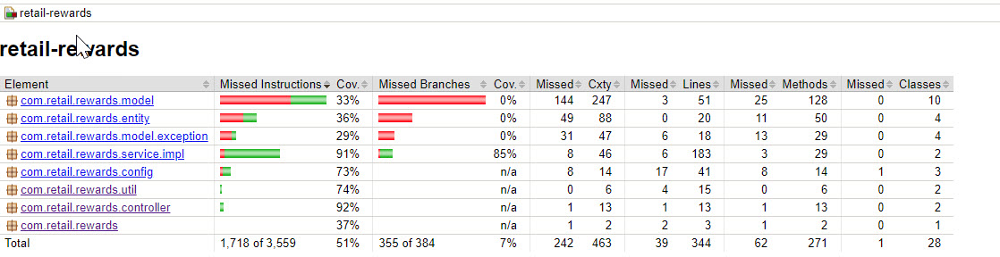

# Retail Rewards Application
* API for customer CRUD operations
* API for transaction CRUD operations
------
# Technical stack
* Java 17
* Maven 3.8.x
* Spring Boot 3.3.1
* Spring Data JPA
* Spring Doc Open API 2.0.3
* Jacoco
* H2 Database (In memory)
------
# How to run application?
* Pre requisite is to set correct Java and Maven path
* Application starts on port `8080`

## Method 1 - Using windows batch files
* Build application using batch file - [build.bat](build.bat)
* Run application using batch file - [run.bat](run.bat)

## Method 2 - Create jar using Maven and execute
* Run below maven command create executable jar
```
mvn clean compile package
```
* Run below command to execute jar file
```
java -jar target\retail-rewards-1.0.0.jar
```

## Method 3 - Using Maven Spring Boot Plugin
* Run below maven command. Application will compile and start
```
mvn clean compile spring-boot:run
```

## Method 4 - Using Maven Executable Jar Plugin
* Run below maven command
```
mvn clean compile exec:java
```
------
# Verify code coverage
* Run below maven command
```
mvn clean test
```
* Open `/target/site/jacoco/index.html` in browser\

------
# H2 Database
* [schema.sql](src/main/resources/schema.sql) - To create database schema on start of application
* [data.sql](src/main/resources/data.sql) - To create sample transactions on start of application
* Access H2 console from http://localhost:8080/h2-console/
  * Username - admin
  * Password - p@ssword
------
# APIs
* Start the application. Refer swagger - http://localhost:8080/swagger-ui/index.html
* Refer postman collection [retail-rewards.postman_collection.json](postman/retail-rewards.postman_collection.json)
------